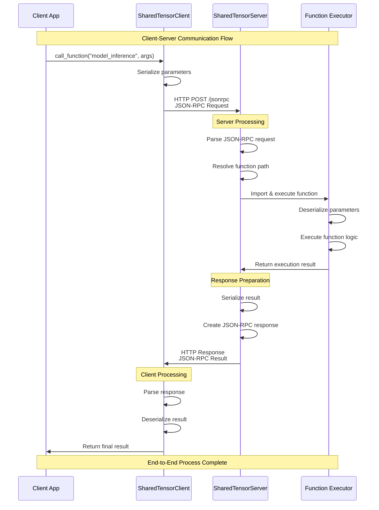

# Shared Tensor

[](https://python.org)
[](https://pytorch.org)
[](LICENSE)

A high-performance library for sharing GPU memory objects across processes using IPC mechanisms with JSON-RPC 2.0 protocol, enabling model and inference engine separation architecture.

## 🚀 Project Overview

Shared Tensor is a cross-process communication library designed specifically for deep learning and AI applications, utilizing IPC mechanisms and JSON-RPC protocol to achieve:

- **Efficient GPU Memory Sharing**: Cross-process sharing of PyTorch tensors and models
- **Remote Function Execution**: Easy remote function calls through decorators
- **Async/Sync Support**: Flexible execution modes for different scenarios
- **Model Serving**: Deploy machine learning models as independent services
- **Distributed Inference**: Support for distributed computing in multi-GPU environments

## 📋 Core Features

### 🔄 Cross-Process Communication
- **JSON-RPC 2.0 Protocol**: Standardized remote procedure calls
- **HTTP Transport**: Reliable HTTP-based communication mechanism
- **Serialization Optimization**: Efficient PyTorch object serialization/deserialization

### 🎯 Function Sharing
- **Decorator Pattern**: Easy function sharing using `@provider.share`
- **Auto Discovery**: Smart function path resolution and import
- **Parameter Passing**: Support for complex data type parameters

### ⚡ Async Support
- **Async Execution**: `AsyncSharedTensorProvider` supports non-blocking calls
- **Task Management**: Complete async task status tracking
- **Concurrent Processing**: Efficient concurrent request handling

### 🖥️ GPU Compatibility
- **CUDA Support**: Native CUDA tensor sharing support
- **Device Management**: Smart data migration between devices
- **Memory Optimization**: Efficient GPU memory usage

## 🛠️ Installation Guide

### Requirements

- **Python**: 3.8+
- **Operating System**: Linux (recommended)
- **PyTorch**: 1.12.0+
- **CUDA**: Optional, for GPU support

### Installation Methods

#### Install from Source

```bash
# Clone the repository
git clone https://github.com/world-sim-dev/shared-tensor.git
cd shared-tensor

# Install dependencies
pip install -r requirements.txt

# Install the package
pip install -e .
```

#### Development Installation

```bash
# Install with development dependencies
pip install -e ".[dev]"

# Install with test dependencies
pip install -e ".[test]"
```

### Verify Installation

```bash
# Check core functionality
python -c "import shared_tensor; print('✓ Shared Tensor installed successfully')"

# Check PyTorch integration
python -c "import torch; import shared_tensor; print('✓ PyTorch integration working')"

# Check CUDA support (if you have GPU)
python -c "import torch; print(f'CUDA available: {torch.cuda.is_available()}')"
```

## 🎯 Quick Start

### 1. Basic Function Sharing

```python
from shared_tensor.provider import SharedTensorProvider

# Create provider
provider = SharedTensorProvider()

# Share simple function
@provider.share(name="add_numbers")
def add_numbers(a, b):
    return a + b

# Share PyTorch function
@provider.share(name="create_tensor")
def create_tensor(shape, device="cpu"):
    import torch
    return torch.zeros(shape, device=device)
```

### 2. Start Server

```bash
# Method 1: Use command line tool
shared-tensor-server

# Method 2: Use script
python scripts/start_server.sh

# Method 3: Custom configuration
python -m shared_tensor.server --host 0.0.0.0 --port 9000
```

### 3. Client Usage

```python
from shared_tensor.client import SharedTensorClient

# Connect to server
client = SharedTensorClient(server_port=2537)

# Remote function call
result = client.call_function("add_numbers", [10, 20])
print(f"Result: {result}")  # Output: Result: 30

# Create remote tensor
tensor = client.call_function("create_tensor", [(3, 4)], {"device": "cuda:0"})
print(f"Tensor shape: {tensor.shape}")
```

### 4. Async Execution

```python
from shared_tensor.async_provider import AsyncSharedTensorProvider
from shared_tensor.async_client import AsyncSharedTensorClient

# Async provider
async_provider = AsyncSharedTensorProvider()

@async_provider.share(name="async_computation")
def heavy_computation(data):
    # Simulate heavy computation
    import time
    time.sleep(2)
    return data * 2

# Async client
async_client = AsyncSharedTensorClient()

# Submit async task
task_id = async_client.submit_task("async_computation", [100])

# Check task status
status = async_client.get_task_status(task_id)
print(f"Task status: {status}")

# Get result
result = async_client.get_task_result(task_id)
print(f"Async result: {result}")
```

## 📖 Detailed Usage

### Model Sharing Example

```python
import torch
import torch.nn as nn
from shared_tensor.provider import SharedTensorProvider

provider = SharedTensorProvider()

# Define model
class SimpleNet(nn.Module):
    def __init__(self, input_size, hidden_size, output_size):
        super().__init__()
        self.fc1 = nn.Linear(input_size, hidden_size)
        self.relu = nn.ReLU()
        self.fc2 = nn.Linear(hidden_size, output_size)
    
    def forward(self, x):
        x = self.fc1(x)
        x = self.relu(x)
        x = self.fc2(x)
        return x

# Share model creation function
@provider.share(name="create_model")
def create_model(input_size=784, hidden_size=128, output_size=10):
    model = SimpleNet(input_size, hidden_size, output_size)
    return model

# Share inference function
@provider.share(name="model_inference")
def model_inference(model, input_data):
    with torch.no_grad():
        return model(input_data)
```

### Distributed Inference

```python
import os
from shared_tensor.provider import SharedTensorProvider

# Support multi-GPU environment
gpu_rank = int(os.getenv("RANK", 0))
provider = SharedTensorProvider(server_port=2537 + gpu_rank)

@provider.share(name="distributed_inference")
def distributed_inference(model, data, device_id):
    device = f"cuda:{device_id}"
    model = model.to(device)
    data = data.to(device)
    
    with torch.no_grad():
        result = model(data)
    
    return result.cpu()
```

## 🔧 Configuration Options

### Server Configuration

```python
from shared_tensor.server import SharedTensorServer

server = SharedTensorServer(
    host="0.0.0.0",           # Listen address
    port=2537,                # Port number
    timeout=30,               # Request timeout
    max_workers=4,            # Maximum worker threads
    enable_cache=True,        # Enable result caching
    debug=False               # Debug mode
)
```

### Client Configuration

```python
from shared_tensor.client import SharedTensorClient

client = SharedTensorClient(
    server_port=2537,         # Server port
    timeout=30,               # Request timeout
    retry_count=3,            # Retry count
    verbose_debug=False       # Verbose debug info
)
```

### Environment Variables

```bash
# Set GPU count
export GPUS_PER_NODE=4

# Set process rank
export RANK=0

# Enable server mode
export __SHARED_TENSOR_SERVER_MODE__=true

# Set Python path
export PYTHONPATH=.:$PYTHONPATH
```

## 🧪 Testing

### Run Test Suite

```bash
# Run all tests
python tests/run_tests.py

# Run specific category tests
python tests/run_tests.py --category unit
python tests/run_tests.py --category integration
python tests/run_tests.py --category pytorch

# Run only PyTorch related tests
python tests/run_tests.py --torch-only

# Verbose output
python tests/run_tests.py --verbose
```

### Test Environment Info

```bash
# Check test environment
python tests/run_tests.py --env-info
```

### Individual Test Files

```bash
# Test tensor serialization
python tests/pytorch_tests/test_tensor_serialization.py

# Test async system
python tests/integration/test_async_system.py

# Test client
python tests/integration/test_client.py
```

## 📚 Examples

Check the `examples/` directory for complete examples:

- **`simple_test.py`**: Basic functionality demonstration
- **`example_usage.py`**: Typical use cases
- **`demo_async_vs_sync.py`**: Async vs sync comparison
- **`example_models.py`**: PyTorch model examples
- **`remote_execution_demo.py`**: Remote execution demo

Run examples:

```bash
# Standalone examples
python examples/simple_test.py
python examples/example_models.py

# Examples requiring server
# Terminal 1: Start server
python scripts/start_server.sh

# Terminal 2: Run examples
python examples/example_usage.py
python examples/demo_async_vs_sync.py
```

## 🏗️ Architecture Design

### Core Components

```
shared-tensor/
├── shared_tensor/              # Core modules
│   ├── server.py              # JSON-RPC server
│   ├── client.py              # Sync client
│   ├── provider.py            # Sync provider
│   ├── async_client.py        # Async client
│   ├── async_provider.py      # Async provider
│   ├── async_task.py          # Async task management
│   ├── jsonrpc.py            # JSON-RPC protocol implementation
│   ├── utils.py              # Utility functions
│   └── errors.py             # Exception definitions
├── scripts/                   # Script tools
├── examples/                  # Usage examples
└── tests/                     # Test suite
```

### Communication Flow



## 🔍 Troubleshooting

### Common Issues

#### 1. Connection Refused
```
ConnectionRefusedError: [Errno 111] Connection refused
```
**Solution**: Ensure server is started
```bash
python scripts/start_server.sh
```

#### 2. Module Import Error
```
ModuleNotFoundError: No module named 'shared_tensor'
```
**Solution**: Check installation and Python path
```bash
pip install -e .
export PYTHONPATH=.:$PYTHONPATH
```

#### 3. CUDA Unavailable
```
RuntimeError: CUDA is not available
```
**Solution**: Use CPU device or install CUDA
```python
# Use CPU
tensor = create_tensor((3, 4), device="cpu")
```

#### 4. Serialization Error
```
PickleError: Can't pickle function
```
**Solution**: Ensure functions are picklable, avoid local functions

### Debug Tips

1. **Enable verbose logging**:
```python
import logging
logging.basicConfig(level=logging.DEBUG)
```

2. **Use debug mode**:
```python
client = SharedTensorClient(verbose_debug=True)
```

3. **Check function paths**:
```python
provider = SharedTensorProvider()
print(provider._registered_functions)
```

## 🤝 Contributing

We welcome community contributions! Please follow these steps:

### Development Environment Setup

```bash
# Clone repository
git clone https://github.com/world-sim-dev/shared-tensor.git
cd shared-tensor

# Create virtual environment
python -m venv venv
source venv/bin/activate

# Install development dependencies
pip install -e ".[dev]"

# Install pre-commit hooks
pre-commit install
```

### Code Standards

```bash
# Code formatting
black shared_tensor/ tests/ examples/

# Import sorting
isort shared_tensor/ tests/ examples/

# Static checking
flake8 shared_tensor/
mypy shared_tensor/
```

### Submission Process

1. Fork the project and create a feature branch
2. Write code and tests
3. Run the complete test suite
4. Submit a Pull Request

### Test Requirements

- New features must include tests
- Maintain test coverage > 90%
- All tests must pass

## 📄 License

This project is licensed under the Apache 2.0 License - see the [LICENSE](LICENSE) file for details

## 🙏 Acknowledgments

- [PyTorch](https://pytorch.org/) - Deep learning framework
- [JSON-RPC 2.0](https://www.jsonrpc.org/) - Remote procedure call protocol
- Athena Team - Project development and maintenance

## 📞 Contact Us

- **Issues**: [GitHub Issues](https://github.com/your-org/athena/issues)
- **Documentation**: [Athena Documentation](https://athena.readthedocs.io/)
- **Source**: [GitHub Repository](https://github.com/your-org/athena)

---

**Shared Tensor** - Making GPU memory sharing simple and efficient 🚀